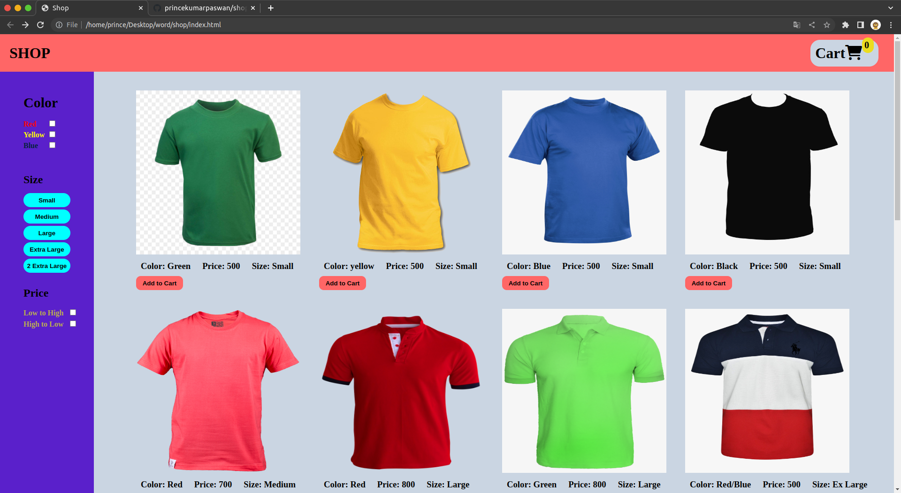

# Shopping-Cart-App | React.js

By Prince Kr Paswan

## [Link to the Shopping-Cart-App](https://shade-up-prince.netlify.app/)

## How it will help you?

It gives you various filter option to filter your product 
according to your need and all you to add to cart and 
and increase/decrease products and all allow you to apply coupon 
and alert when the adress entered and checkout is clicked .

## This project took around 8 hours to complete.